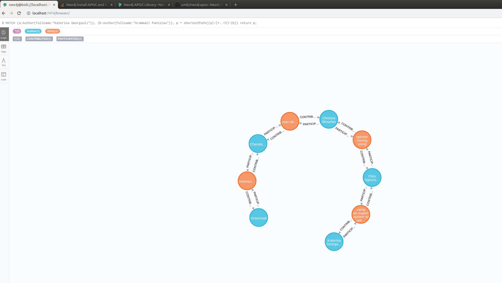

### ERESEARCH REPOSITORER NEO4J EXPORTER

#### Description

This service transforms [eresearch-repositorer-platform](https://github.com/chriniko13/eresearch-repositorer-platform) mongo database to neo4j graph database,
in order to focus on relations of extracted authors.


#### Dependencies

* Neo4J Docker Run:
    ```
    docker run \
        --name testneo4j \
        -p7474:7474 -p7687:7687 \
        -d \
        -v $HOME/neo4j/data:/data \
        -v $HOME/neo4j/logs:/logs \
        -v $HOME/neo4j/import:/var/lib/neo4j/import \
        -v $HOME/neo4j/plugins:/plugins \
        --env NEO4J_AUTH=neo4j/test \
        neo4j:latest
    ```
    
* For more info see: `https://neo4j.com/developer/docker-run-neo4j/`


#### Build
Execute: `mvn clean install`


#### Run
* First you need to have run the dependencies (neo4j instance) and having a running mongo instance 
  of eresearch repositorer platform, for more details see: [eresearch repositorer platform](https://github.com/chriniko13/eresearch-repositorer-platform)

* Build first and then execute: `java -jar target/eresearch-repo-neo4j-exporter-1.0.0-SNAPSHOT.jar`


#### Perform a backup
* Enter in docker container with bash: `docker exec -it testneo4j bash`

* Then: `cd data/databases`

* Then: `tar -zcf graph.db.tar.gz graph.db/`

* Then: `docker cp <containerId>:/file/path/within/container /host/path/target`

* Then: go back to host terminal and execute: `docker cp testneo4j:/var/lib/neo4j/data/databases/graph.db.tar.gz .`


#### Restore a backup
* Enter in docker container with bash: `docker exec -it testneo4j bash`

* Then: `cd data/databases`

* Then: `rm -rf graph.db`

* Then: copy the back up from host (graph.db.tar.gz file in this directory) to docker container: `docker cp graph.db.tar.gz testneo4j:/var/lib/neo4j/data/databases`

* Then inside docker container where you copied the tar file, untar it with the command: `tar -zxf graph.db.tar.gz`


#### Sample Queries

1.
```
MATCH (a:Author{fullname:"Christos Skourlas"}) RETURN a;
```

2.
```
MATCH (a:Author{fullname:"Christos Skourlas"}), (b:Author{fullname:"Anastasios Tsolakidis"}),
p = shortestPath((a)-[*..15]-(b))
return p;
```

3.
```
MATCH (a:Author{fullname:"Christos Skourlas"}), (b:Author{fullname:"Anastasios Tsolakidis"}),
p = shortestPath((a)-[*..15]-(b))
return p;
```

4.
```
MATCH (a:Author{fullname:"Christos Skourlas"}), (b:Author{fullname:"Anastasios Tsolakidis"}),
p = allShortestPaths((a)-[*..15]-(b))
return p;
```

5.
```
MATCH (a:Author{fullname:"Katerina Georgouli"}), (b:Author{fullname:"Grammati Pantziou"}),
p = shortestPath((a)-[*..15]-(b))
return p;
```

6.
```
match (e:Entry)
return  (e.title);
```

7.
```
match (e:Entry)
return  distinct (e.title);
```

8.
```
match (e:Entry)
return  count (e.title);
```

9.
```
match (a:Author)
return  (a.fullname);
```

#### Icons Sample


